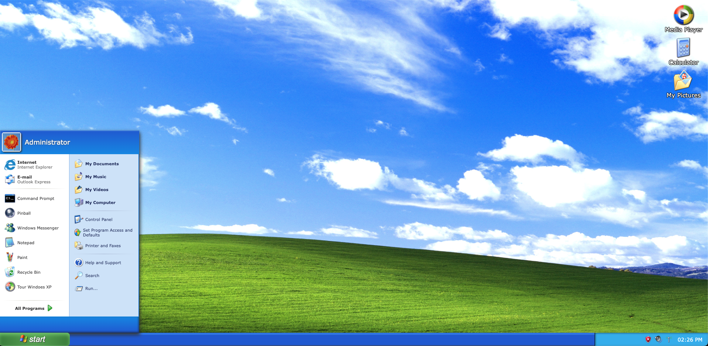

# FakeOS

The fake operating system app is a web-based app that imitates the look and feel of the popular Windows XP operating system. It includes a desktop with a Start menu, taskbar, and three desktop icons. Users can launch and interact with fake applications, such as a web calculator, image gallery, and media player. The app was built using JavaScript, HTML, SCSS, and CSS, and is designed to be a fun and nostalgiac tribute to the classic operating system.
## Screenshots

<figure>
<figcaption><i>Main Page</i></figcaption>

</figure>

---

## Requirements / MVP

- SPA (Single Page Application)
- Desktop has a wallpaper that fits the viewport
- 3 selectable icons
- Selecting an icon will open an "app", creating a modal to display some content
- Able to close an app
- There will be a selectable menu
- Selecting the menu will display a list of text and icons
- The current time is displayed somewhere

---

## Getting Started

To get started with this project, clone the repository and install the dependencies:

`git clone git@github.com:matheuslincon/fakeos-nology.git`

`cd fakeos-nology`

You can now open the index.html file in your local repository folder.

---

